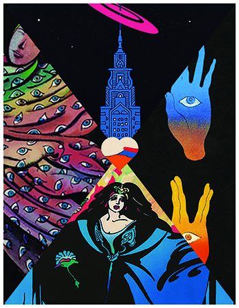
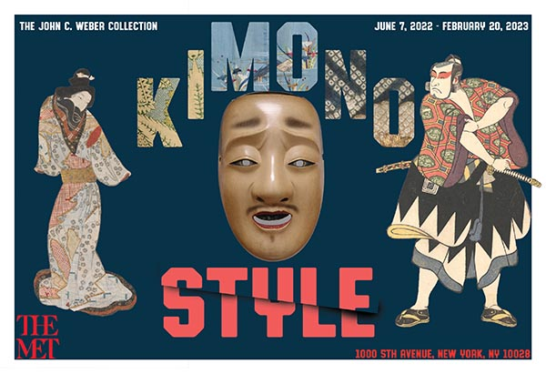
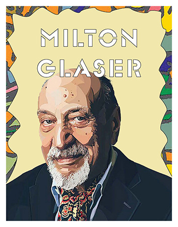

   <main>
     <section class="About">
      <h2 id="abo">About</h2>
      
      
Hello, My name is Fidel Perez and I am a currently attending school at the Borough of Manhattan Community College. My current major is Multimedia Design and Programming. I am learning both web developement and graphic design. I specialize in creating sites using Html and CSS. I am familiar in using Adobe suite such as Indesign, Photoshop and Illustrator. Thank you for visiting my site.

     </section>

    <section class="work">

    <h2 id="pro" >Projects</h2>

   

   

      <h3> Postcard </h3>
      
      
This goal of this work was to create a postcard based on a local event. The event I chose was an ancinet japanese art exhibit that was being shown at the Museum of Modern Art in New York City.

    

   

      <h3> Article Cover</h3>
      
      
I made this cover to represent the work of Milton Glaser based on a article that described most of his work before he passed away.

    
  
    
  
  
   
  </section>
    <section class="contact">
      <h2 id="con" >Say Hello</h2>
      
Thank you for visiting my. If you wish to contact me with further inquiries  just send me an email <a href="mailto:perez.fidel@stu.bmcc.cuny.edu">here.</a>

     </section>

   </main>

